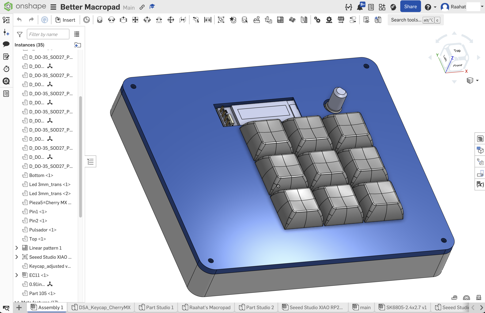
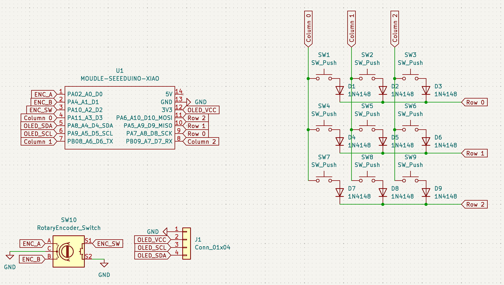
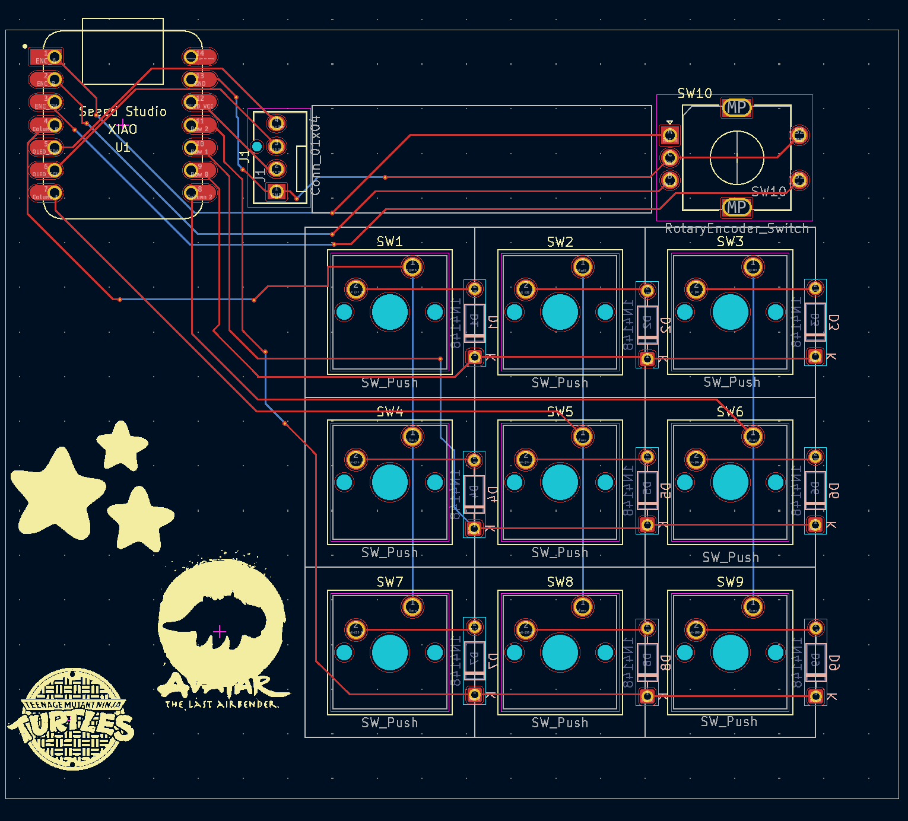

# Raahat's Simple Macropad (Hackpad)

Welcome to the repository for my custom Macropad! It features 9 mechanical keys, a rotary encoder for volume/scrolling control, and an OLED screen.

The firmware is powered by KMK.

## Project Gallery

### Overall Hackpad

### Schematic

### PCB Layout

---

## 🛠️ Bill of Materials (BOM)

Here is the complete list of components required to build the PCB for this macropad:

| Designator | Footprint | Quantity | Value |
|:---|:---|:---:|:---|
| D1, D2, D3, D4, D5, D6, D7, D8, D9 | `D_DO-35_SOD27_P7.62mm_Horizontal` | 9 | 1N4148 |
| J1 | `FanPinHeader_1x04_P2.54mm_Vertical` | 1 | Conn_01x04 |
| SW1, SW2, SW3, SW4, SW5, SW6, SW7, SW8, SW9 | `SW_Cherry_MX_1.00u_PCB` | 9 | SW_Push |
| SW10 | `RotaryEncoder_Alps_EC11E-Switch_Vertical_H20mm` | 1 | RotaryEncoder_Switch |
| U1 | `XIAO-Generic-Hybrid-14P-2.54-21X17.8MM` | 1 | MODULE-SEEEDUINO-XIAO |

### Additional Hardware:
* **Microcontroller:** 1x Seeed Studio XIAO (RP2040, SAMD21, or similar)
* **Switches:** 9x Cherry MX-compatible mechanical switches (3-pin or 5-pin)
* **Keycaps:** 9x 1U Keycaps
* **Encoder Knob:** 1x Knob compatible with standard EC11 rotary encoders
* **Screen:** 1x 0.91" or 0.96" I2C OLED Display
* **Fasteners:** M3 Heat-set inserts & M3 Screws (for the 3D printed case)

---